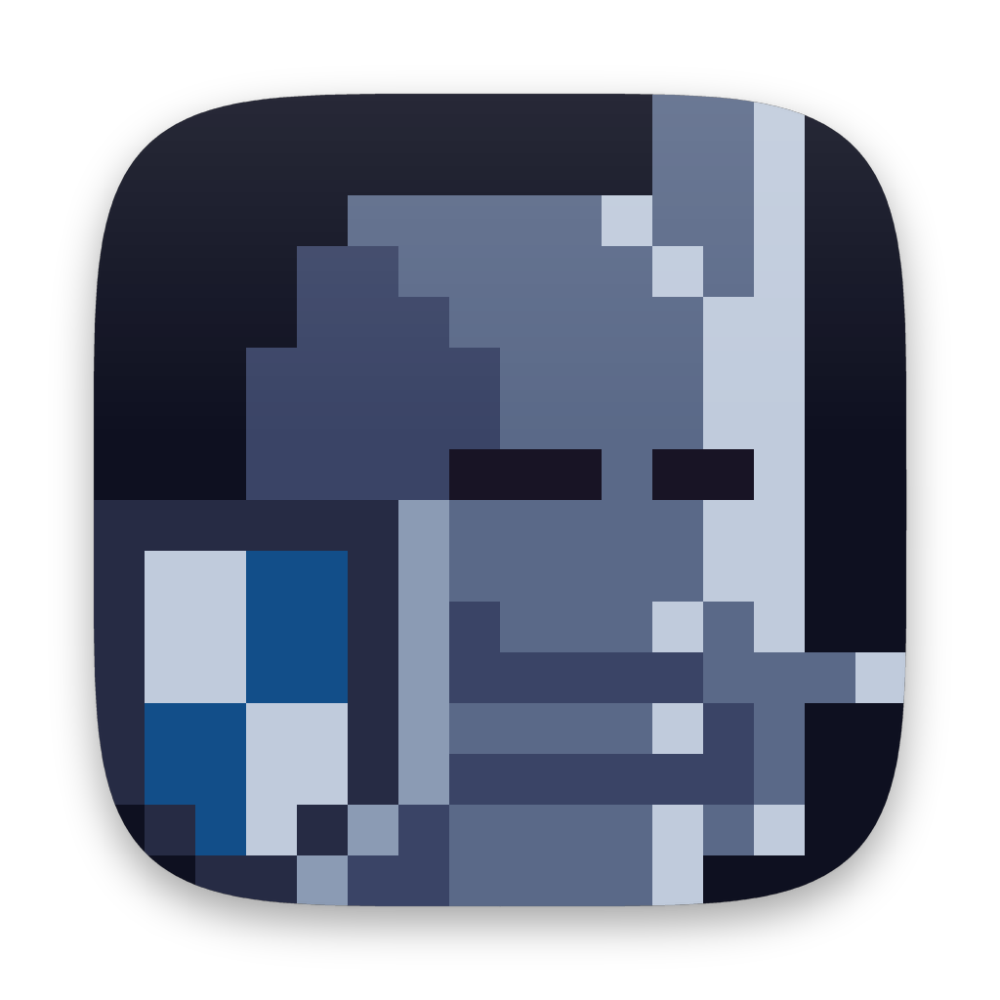

<div align="center">



# Keeper

**A pixel-art knight that closes the browser tabs you told him to keep you away from.**


[Download](#install) · [How it works](#how-it-detects) · [Security](SECURITY.md)

</div>

---

## What it is

Keeper is a single small Mac app that lives in the menu bar. You tell it which sites and which
apps you are not visiting this session, press **Start session**, and a knight takes his post at
the end of the Dock. When one of those sites opens in any browser, he runs over, asks *"Are you
trying to enter youtube.com?"*, and closes the tab. When one of those apps comes forward, he asks
the same question and hides it.

No timers. No accounts. No network. No third-party packages. Nothing you type into it leaves your
Mac.

1. Click the shield in the menu bar. Add the sites you won't visit — type a name, paste a page
   address, or pick one from **Presets** — and the apps you won't open, from **Choose**.
2. Press **Start session**. The knight takes his post and both lists lock.
3. Open one of those sites or apps and he deals with it.
4. Press **Stop session** when you are done.

<!-- Screenshots: drop panel.png, knight.png and window.png into docs/screenshots/
     and uncomment the table below.

| The panel | The knight on duty | The window |
|---|---|---|
|  |  |  |
-->

## Install

**Download the disk image** from [Releases](../../releases), drag Keeper to Applications, and open
it.

Keeper is signed but **not notarized**, because notarizing needs a paid Apple Developer account.
So the first time you open it macOS says it cannot verify the developer. Clear it once through
**System Settings → Privacy & Security → Open Anyway**, and everything after that is normal. The
disk image ships a plain-language note that walks through this in English and Ukrainian.

Keeper then asks for one permission: **Accessibility**. That is what lets it read which page a
browser is showing and close the tab. Nothing else is requested, and nothing is installed outside
the app bundle.

**Or build it yourself** — same source you are reading:

```sh
scripts/build-app.sh      # → build/Keeper.app
```

## Sites

Each entry is a host, optionally with a path: `youtube.com`, `reddit.com/r/funny`, or a bare word
like `twitter` that matches any host label. Scheme, `www.`, query and trailing slash are ignored,
and matching covers subdomains.

Pasting a full page address is read as "this whole site", so pasting a video link blocks
`youtube.com` rather than `youtube.com/watch`. Text typed without a scheme is taken literally, so
`reddit.com/r/funny` still means only that corner of Reddit.

## Apps

An app on the list is held by its bundle identifier, so renaming it, running a beta build or
keeping a second copy elsewhere does not break the rule. **Choose** lists what is running right
now, and nests everything else in your Applications folders underneath.

When the knight catches one he **hides** it: the windows leave the screen and ⌘Tab, the app keeps
running, nothing closes and nothing is lost. Stopping the session does not bring hidden apps back;
⌘Tab does, whenever you want it.

Three apps can never be added, and the menu says why: **System Settings**, because that is where
Keeper's own access is revoked; **Finder**, because hiding it takes the desktop with it; and
**Keeper**, because that is the window with Stop session in it.

## Where Keeper lives

Three surfaces, one job each.

| Surface | What it is for | How you get there |
|---|---|---|
| **The panel** | The whole task: the state, the list, Start and Stop | Click the menu bar shield |
| **The window** | The same list with room to breathe, and the Accessibility step | "Open Keeper", or the Dock icon |
| **Settings** | Where Keeper appears, and whether it starts at login | "Settings…", or ⌘, |

The panel is the app — everything you can do, you can do without opening a window. The menu bar
shield is an empty outline while Keeper waits and filled like smoked glass while a session runs.
**Show in menu bar** and **Show in Dock** let you decide where Keeper appears; it will not let you
switch off both, so there is always a way back in.

## How it detects

One mechanism for every browser: the macOS **Accessibility API**. Once a second Keeper reads the
page address of each visible browser window from its accessibility tree, which works the same way
in Safari, Chrome, Arc, Brave, Edge, Firefox, Zen, Orion and anything else that shows a web page.

To close a tab, Keeper raises the window, re-checks that the page still matches, presses ⌘W,
verifies, and falls back to the tab's close button. A window that refuses gets a three-second
cooldown rather than a retry loop. Finding a blocked app is far cheaper — a list of running
applications rather than a tree walk — so that happens on every tick first.

## Privacy and security

Accessibility access is the widest grant on a Mac, so it is worth being precise about what Keeper
does with it. **[SECURITY.md](SECURITY.md)** is the full account; the short version:

- **It cannot talk to the network.** Not "does not" — there is no `URLSession`, no socket, no
  `Network` framework, and nothing that starts another program. No third-party packages either.
- **Nothing about your browsing is written down.** No page address reaches a file, a log or the
  console.
- **The ⌘W keystroke is aimed, not broadcast**, and the page is re-checked immediately before it.
- **It hides apps, it never quits them**, so nothing it does can lose you work.
- **It is not sandboxed** (the Accessibility API is not available to sandboxed apps) and **not
  notarized**.

## Build and test

```sh
scripts/build-app.sh      # → build/Keeper.app
swift test                # unit tests
scripts/make-icon.py      # → Assets/AppIcon.icon and Assets/AppIcon.icns
scripts/make-dmg.sh       # → build/Keeper-<version>.dmg
```

Launch flags: `--start` begins a session immediately with the saved list. A debug build also
honours `--probe`, `--panel`, `--settings` and `KEEPER_ASSUME_TRUSTED=1` for inspecting things by
hand; all of them are compiled out of release builds.

The app is signed with an Apple Development identity if one is in your keychain, otherwise ad-hoc,
and always with the hardened runtime. With ad-hoc signing macOS ties the Accessibility grant to
the exact binary, so after a rebuild you may need to switch Keeper off and on again in the
Accessibility list; `scripts/make-signing-cert.sh` creates a local identity that stops that.

## Languages

Keeper follows your Mac's language — set the system to German and it is German. Seven ship today:

**English · Ukrainian · Russian · German · French · Italian · Polish**

macOS matches them against your language order the way it does for its own apps, so Keeper has no
language setting of its own to get out of step with the system.

Strings live in `Sources/Keeper/Resources/<language>.lproj/Localizable.strings`, with plural forms
in the matching `.stringsdict` — Ukrainian, Russian and Polish decline their numbers three ways
where English has two. A new language is a new `.lproj` folder plus an entry in
`CFBundleLocalizations` in `scripts/build-app.sh`, with no code change.

Check one without changing your Mac:

```sh
build/Keeper.app/Contents/MacOS/Keeper -AppleLanguages "(pl)"
```

`swift test` fails if a key used in code is missing from English, if the languages disagree about
which keys exist, if a translation is left as its English original, if a plural is missing a form
its language needs, if a translation takes different arguments from the English, or if a `.lproj`
folder on disk is missing from the bundle's language list.

## Limits

- A blocked page in a background tab is caught the moment it becomes visible.
- Windows on another Space are left alone until you switch to that Space.
- Pinned tabs that ignore ⌘W and have no close button are reported rather than forced.
- An app with no windows — a menu bar tool — has nothing to hide, and is reported rather than
  pretended about.
- A domain written in a script other than Latin may not match; see [SECURITY.md](SECURITY.md).

## Credits

Knight: **"Animated Knight Character Pack v3.0"** by [rgsdev](https://opengameart.org/content/animated-knight-character-pack-v20),
CC BY-SA 4.0 — see [`Assets/LICENSE-knight.md`](Assets/LICENSE-knight.md). Interface icons are SF
Symbols.

## License

Keeper's source is released under the MIT License — see [`LICENSE`](LICENSE). The knight sprite is
**not** MIT: it is CC BY-SA 4.0 by rgsdev and keeps that license wherever it goes.
